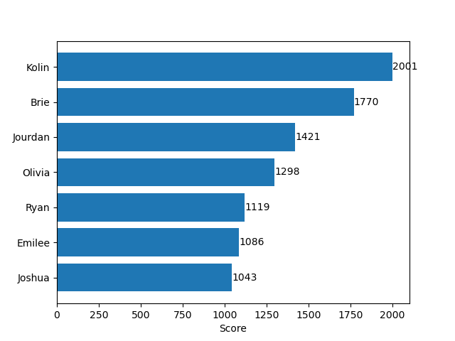
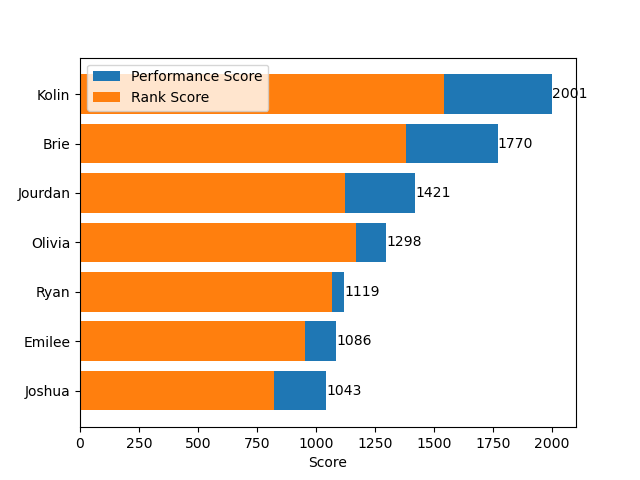
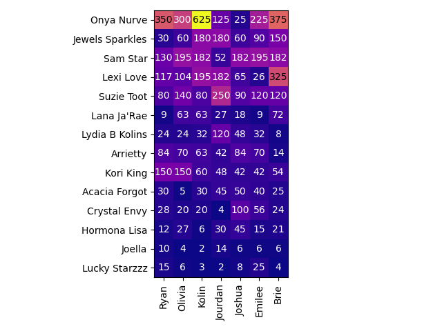
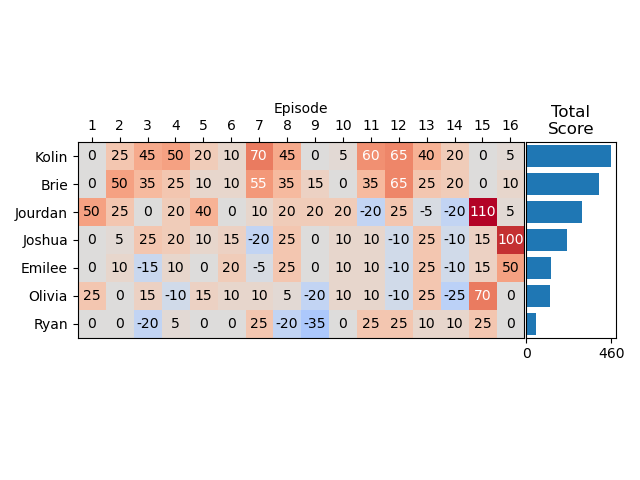

# RuPaul's Drag Race Season 17 Fantasy League

This is the fantasy league for RuPaul's Drag Race I ran for some friends. I ran it out of Google Sheets, but it was kind of a pain to maintain that way, so I decided to make myself an app to manage the scoring for me. I've tested it out by recreating the league from this season.

This season's queens are:
- Acacia Forgot
- Arrietty
- Crystal Envy
- Hormona Lisa
- Jewels Sparkles
- Joella
- Kori King
- Lana Ja'Rae
- Lexi Love
- Lucky Starzzz
- Lydia B Kolins
- Onya Nurve
- Sam Star
- Suzie Toot

## Scoring

There are two ways to earn points: the **performance** of your team and the **rank** of each queen.

### Performances

Each week, you gain or lose points when the following things happen to your team member:

| Event                   |   Point Value |
|:------------------------|--------------:|
| Tops                    |            10 |
| Win Main Challenge      |            15 |
| Bottoms                 |            -5 |
| Lip Sync For Your Life  |           -10 |
| Lip Sync Winner         |             5 |
| Win Mini Challenge      |            10 |
| Double Sashay           |           -15 |
| Double Shantay          |            15 |
| Runway Malfunction      |            -5 |
| Wig Reveal              |             5 |
| Lip Sync Malfunction    |            -5 |
| Miss Congeniality       |            50 |
| Wins Lip Sync Smackdown |            30 |

Points have 2 times greater value for your captain.

The Tops and Bottoms of the week are determined based on who gets critiqued. This is usually six queens, but near the end of the show it will be fewer.

In a lip sync smackdown, points are earned each time a queen wins a lip sync, but no points are deducted for a queen being eliminated from the bracket.

### Ranks

Based on how a queen ranks, they will earn a select number of points. Those points will be multiplied by the point value of the rank assigned in the team selection.

**Note:** This scoring system assumes a final four and no double sashays. In a final four, third and fourth place are worth the same. The teammate you think will be runner-up is worth slightly more than the third teammate. Rules will be adjusted if needed.

|   Rank |   Worth of the Team |   Worth of the Queen |
|-------:|--------------------:|---------------------:|
|      1 |                  25 |                   25 |
|      2 |                  15 |                   15 |
|      3 |                  14 |                   13 |
|      4 |                  12 |                   13 |
|      5 |                  10 |                   10 |
|      6 |                   9 |                    9 |
|      7 |                   8 |                    8 |
|      8 |                   7 |                    7 |
|      9 |                   6 |                    6 |
|     10 |                   5 |                    5 |
|     11 |                   4 |                    4 |
|     12 |                   3 |                    3 |
|     13 |                   2 |                    2 |
|     14 |                   1 |                    1 |

#### Example

- Team 1 ranks Jinkx 12th
- Team 2 ranks Jinkx 5th
- Team 3 ranks Jinkx as their captain

Jinkx finishes in 4th, so she is worth 13 points. Then:

- Team 1 earns 3 x 13 = 39 points
- Team 2 earns 10 x 13 = 130 points
- Team 3 earns 25 x 13 = 325 points

## Teams

This is how everybody ranked the queens this season:

| Rank                 | Brie            | Emilee          | Joshua          | Jourdan         | Kolin           | Olivia          | Ryan            |
|:---------------------|:----------------|:----------------|:----------------|:----------------|:----------------|:----------------|:----------------|
| Winner (Captain)     | Lexi Love       | Lucky Starzzz   | Crystal Envy    | Suzie Toot      | Onya Nurve      | Kori King       | Kori King       |
| Runner-up (Teammate) | Onya Nurve      | Sam Star        | Hormona Lisa    | Lydia B Kolins  | Lexi Love       | Sam Star        | Lucky Starzzz   |
| 3rd (Teammate)       | Sam Star        | Crystal Envy    | Sam Star        | Lexi Love       | Sam Star        | Suzie Toot      | Onya Nurve      |
| 4                    | Suzie Toot      | Suzie Toot      | Arrietty        | Jewels Sparkles | Jewels Sparkles | Onya Nurve      | Arrietty        |
| 5                    | Jewels Sparkles | Arrietty        | Acacia Forgot   | Hormona Lisa    | Kori King       | Arrietty        | Sam Star        |
| 6                    | Kori King       | Onya Nurve      | Suzie Toot      | Acacia Forgot   | Arrietty        | Hormona Lisa    | Lexi Love       |
| 7                    | Lana Ja'Rae     | Acacia Forgot   | Lucky Starzzz   | Kori King       | Suzie Toot      | Lexi Love       | Suzie Toot      |
| 8                    | Hormona Lisa    | Kori King       | Kori King       | Joella          | Lana Ja'Rae     | Lana Ja'Rae     | Crystal Envy    |
| 9                    | Crystal Envy    | Jewels Sparkles | Lydia B Kolins  | Arrietty        | Acacia Forgot   | Lucky Starzzz   | Acacia Forgot   |
| 10                   | Acacia Forgot   | Hormona Lisa    | Lexi Love       | Onya Nurve      | Crystal Envy    | Crystal Envy    | Joella          |
| 11                   | Lucky Starzzz   | Lydia B Kolins  | Jewels Sparkles | Sam Star        | Lydia B Kolins  | Jewels Sparkles | Hormona Lisa    |
| 12                   | Joella          | Joella          | Joella          | Lana Ja'Rae     | Lucky Starzzz   | Lydia B Kolins  | Lydia B Kolins  |
| 13                   | Arrietty        | Lexi Love       | Lana Ja'Rae     | Lucky Starzzz   | Hormona Lisa    | Joella          | Jewels Sparkles |
| 14                   | Lydia B Kolins  | Lana Ja'Rae     | Onya Nurve      | Crystal Envy    | Joella          | Acacia Forgot   | Lana Ja'Rae     |

## Total Scores

Here's how everybody did overall this season:

|                   |   Kolin |   Brie |   Jourdan |   Olivia |   Ryan |   Emilee |   Joshua |
|:------------------|--------:|-------:|----------:|---------:|-------:|---------:|---------:|
| Performance Score |     460 |    390 |       300 |      130 |     50 |      135 |      220 |
| Rank Score        |    1541 |   1380 |      1121 |     1168 |   1069 |      951 |      823 |
| Total Score       |    2001 |   1770 |      1421 |     1298 |   1119 |     1086 |     1043 |

## Rank Scores

Here is how every queen finished and how many points they earned for each contestant in the league. Queens still in the competition are at the bottom:
ß

## Performance Scores

Here's how well everyone's team did on a week-to-week basis:

Here is the breakdown of how each queen scored each week:

