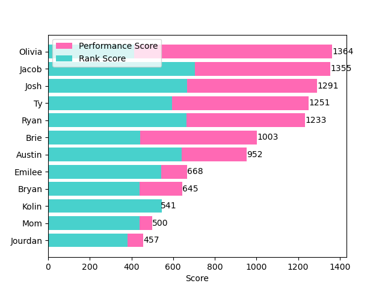
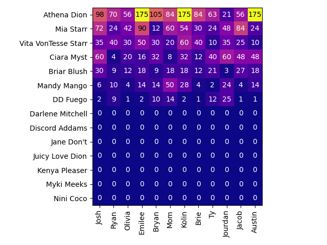
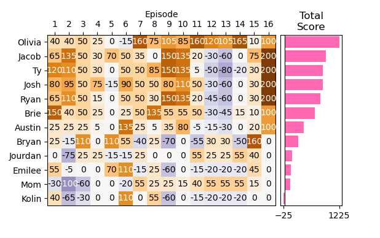
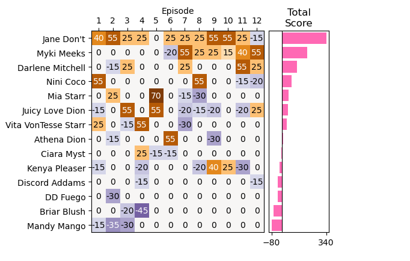

# RuPaul's Drag Race Season 18 Fantasy League

This is the fantasy league for the current season of RuPaul's Drag Race.

This season's queens are:
- Athena Dion
- Briar Blush
- Ciara Myst
- DD Fuego
- Darlene Mitchell
- Discord Addams
- Jane Don't
- Juicy Love Dion
- Kenya Pleaser
- Mandy Mango
- Mia Starr
- Myki Meeks
- Nini Coco
- Vita VonTesse Starr

Jump to a section:
- [Scoring](#scoring)
- [Teams](#teams)
- [Total Scores](#total-scores)
- [Rank Scores](#rank-scores)
- [Performance Scores](#performance-scores)

## Scoring

There are two ways to earn points: the **performance** of your team and the **rank** of each queen.

### Performances

Each week, you gain or lose points when the following things happen to your team member:

| Event                   |   Point Value |
|:------------------------|--------------:|
| Tops                    |            25 |
| Win Main Challenge      |            30 |
| Bottoms                 |           -15 |
| Lip Sync For Your Life  |           -15 |
| Lip Sync Winner         |            10 |
| Win Mini Challenge      |            15 |
| Double Sashay           |           -30 |
| Double Shantay          |            30 |
| Runway Malfunction      |           -15 |
| Wig Reveal              |            15 |
| Lip Sync Malfunction    |           -15 |
| Miss Congeniality       |           100 |
| Wins Lip Sync Smackdown |            60 |

Points have 2 times greater value for your captain.

The Tops and Bottoms of the week are determined based on who gets critiqued. This is usually six queens, but near the end of the show it will be fewer.

In a lip sync smackdown, points are earned each time a queen wins a lip sync, but no points are deducted for a queen being eliminated from the bracket.

### Ranks

Based on how a queen ranks, they will earn a select number of points. Those points will be multiplied by the point value of the rank assigned in the team selection.

**Note:** This scoring system assumes a final four and no double sashays. In a final four, third and fourth place are worth the same. The teammate you think will be runner-up is worth slightly more than the third teammate. Rules will be adjusted if needed.

|   Rank |   Worth of the Team |   Worth of the Queen |
|-------:|--------------------:|---------------------:|
|      1 |                  25 |                   25 |
|      2 |                  15 |                   15 |
|      3 |                  14 |                   13 |
|      4 |                  12 |                   13 |
|      5 |                  10 |                   10 |
|      6 |                   9 |                    9 |
|      7 |                   8 |                    8 |
|      8 |                   7 |                    7 |
|      9 |                   6 |                    6 |
|     10 |                   5 |                    5 |
|     11 |                   4 |                    4 |
|     12 |                   3 |                    3 |
|     13 |                   2 |                    2 |
|     14 |                   1 |                    1 |

#### Example

- Team 1 ranks Jinkx 12th
- Team 2 ranks Jinkx 5th
- Team 3 ranks Jinkx as their captain

Jinkx finishes in 4th, so she is worth 13 points. Then:

- Team 1 earns 3 x 13 = 39 points
- Team 2 earns 10 x 13 = 130 points
- Team 3 earns 25 x 13 = 325 points

## Teams

This is how everybody ranked the queens this season:

| Rank                 | Austin              | Brie                | Bryan               | Emilee              | Jacob               | Josh                | Jourdan             | Kolin               | Mom                 | Olivia              | Ryan                | Ty                  |
|:---------------------|:--------------------|:--------------------|:--------------------|:--------------------|:--------------------|:--------------------|:--------------------|:--------------------|:--------------------|:--------------------|:--------------------|:--------------------|
| Winner (Captain)     | Athena Dion         | Nini Coco           | Juicy Love Dion     | Athena Dion         | Jane Don't          | Jane Don't          | DD Fuego            | Athena Dion         | Mandy Mango         | Myki Meeks          | Jane Don't          | Jane Don't          |
| Runner-up (Teammate) | Jane Don't          | Jane Don't          | Athena Dion         | Mia Starr           | Kenya Pleaser       | Ciara Myst          | Ciara Myst          | Nini Coco           | Myki Meeks          | Jane Don't          | Discord Addams      | Kenya Pleaser       |
| 3rd (Teammate)       | Kenya Pleaser       | Darlene Mitchell    | Nini Coco           | Nini Coco           | Mia Starr           | Athena Dion         | Darlene Mitchell    | Mandy Mango         | DD Fuego            | Darlene Mitchell    | Kenya Pleaser       | Nini Coco           |
| 4                    | Ciara Myst          | Athena Dion         | Jane Don't          | Discord Addams      | Ciara Myst          | Mia Starr           | Mandy Mango         | Vita VonTesse Starr | Athena Dion         | Juicy Love Dion     | Nini Coco           | DD Fuego            |
| 5                    | Discord Addams      | Juicy Love Dion     | DD Fuego            | Vita VonTesse Starr | Discord Addams      | Briar Blush         | Myki Meeks          | Jane Don't          | Mia Starr           | Nini Coco           | Athena Dion         | Ciara Myst          |
| 6                    | Juicy Love Dion     | Myki Meeks          | Kenya Pleaser       | Juicy Love Dion     | Briar Blush         | Discord Addams      | Kenya Pleaser       | Mia Starr           | Jane Don't          | Kenya Pleaser       | DD Fuego            | Athena Dion         |
| 7                    | Myki Meeks          | Vita VonTesse Starr | Ciara Myst          | Myki Meeks          | Athena Dion         | Darlene Mitchell    | Mia Starr           | Ciara Myst          | Discord Addams      | Athena Dion         | Vita VonTesse Starr | Juicy Love Dion     |
| 8                    | Mandy Mango         | Kenya Pleaser       | Mandy Mango         | Mandy Mango         | Juicy Love Dion     | Vita VonTesse Starr | Vita VonTesse Starr | Myki Meeks          | Juicy Love Dion     | Mia Starr           | Myki Meeks          | Briar Blush         |
| 9                    | Briar Blush         | Discord Addams      | Vita VonTesse Starr | Briar Blush         | Myki Meeks          | Juicy Love Dion     | Discord Addams      | Briar Blush         | Briar Blush         | Vita VonTesse Starr | Juicy Love Dion     | Discord Addams      |
| 10                   | Nini Coco           | Mia Starr           | Myki Meeks          | Kenya Pleaser       | Vita VonTesse Starr | Myki Meeks          | Juicy Love Dion     | Discord Addams      | Darlene Mitchell    | Ciara Myst          | Mandy Mango         | Myki Meeks          |
| 11                   | Mia Starr           | Briar Blush         | Discord Addams      | Ciara Myst          | Darlene Mitchell    | Kenya Pleaser       | Jane Don't          | Kenya Pleaser       | Vita VonTesse Starr | Briar Blush         | Mia Starr           | Mia Starr           |
| 12                   | Darlene Mitchell    | Ciara Myst          | Briar Blush         | Jane Don't          | Nini Coco           | Mandy Mango         | Athena Dion         | Juicy Love Dion     | Kenya Pleaser       | Discord Addams      | Briar Blush         | Darlene Mitchell    |
| 13                   | Vita VonTesse Starr | Mandy Mango         | Mia Starr           | DD Fuego            | Mandy Mango         | DD Fuego            | Nini Coco           | DD Fuego            | Ciara Myst          | Mandy Mango         | Darlene Mitchell    | Vita VonTesse Starr |
| 14                   | DD Fuego            | DD Fuego            | Darlene Mitchell    | Darlene Mitchell    | DD Fuego            | Nini Coco           | Briar Blush         | Darlene Mitchell    | Nini Coco           | DD Fuego            | Ciara Myst          | Mandy Mango         |

## Total Scores

Here's how everybody is doing overall this season:

|                   |   Ty |   Josh |   Jacob |   Brie |   Ryan |   Olivia |   Bryan |   Austin |   Emilee |   Jourdan |   Kolin |   Mom |
|:------------------|-----:|-------:|--------:|-------:|-------:|---------:|--------:|---------:|---------:|----------:|--------:|------:|
| Performance Score |  310 |    300 |     280 |    265 |    240 |      155 |     120 |       80 |       50 |       -25 |     -55 |  -190 |
| Rank Score        |   35 |     38 |      32 |     17 |     28 |       17 |      33 |       33 |       34 |        52 |      48 |    82 |
| Total Score       |  345 |    338 |     312 |    282 |    268 |      172 |     153 |      113 |       84 |        27 |      -7 |  -108 |

## Rank Scores

Here is how every queen finished and how many points they earned for each contestant in the league. Queens still in the competition are at the bottom:

## Performance Scores

Here's how well everyone's team is doing on a week-to-week basis:

Here is the breakdown of how each queen scored each week:

