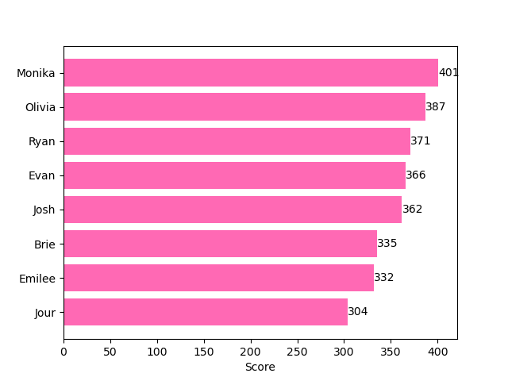
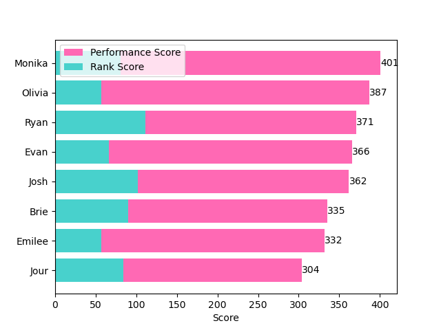
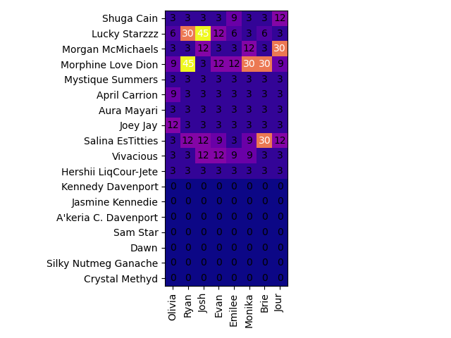
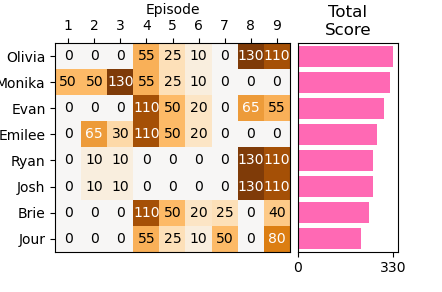
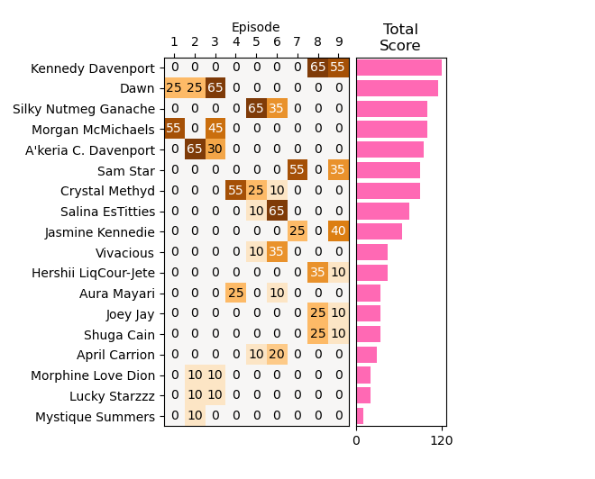

# RuPaul's Drag Race All Stars Season as11 Fantasy League

This is the fantasy league for Season 11 (2026) of RuPaul's Drag Race All Stars.

This season's queens are:
- A'keria C. Davenport
- April Carrion
- Aura Mayari
- Crystal Methyd
- Dawn
- Hershii LiqCour-Jete
- Jasmine Kennedie
- Joey Jay
- Kennedy Davenport
- Lucky Starzzz
- Morgan McMichaels
- Morphine Love Dion
- Mystique Summers
- Salina EsTitties
- Sam Star
- Shuga Cain
- Silky Nutmeg Ganache
- Vivacious

Jump to a section:
- [Scoring](#scoring)
- [Teams](#teams)
- [Total Scores](#total-scores)
- [Rank Scores](#rank-scores)
- [Performance Scores](#performance-scores)

## Scoring

### The Tournament of All Stars

This season is a "Tournament of All Stars." There are 18 queens split into 3 heats (the show incorrectly calls this a bracket). Three queens will advance from each heat to the semifinals. The other 9 queens will initially tie for 10th place. For bookkeeping purposes, this will occur after episode 9.

In the semifinals, there will be two elimination episodes (10 and 11) before the bracket. Those queens will initially come in 9th and 8th place.

At this point, there are 7 queens remaining. One of the queens who was previously eliminated will re-enter the race as a wild card. All the other eliminated queens will drop a rank (e.g. the queens that didn't make it out of their heat will drop from 10th place to 11th place). Finally, the 8 remaining queens compete in a Lip Sync Smackdown For The Crown. The four queens eliminated in the first round tie for 5th place, the two queens eliminated in the second round tie for 3rd place, and the final lip sync determines the winner and runner-up.

### Updated Rules

In All Stars 11, it was announced that only two queens advance from each heat. Since teams were submitted with the below rules, the original rankings will continue. ~~We don't know what will happen once the semifinals start, but it's possible that some queens may have been assigned ranks that will never actually exist this season.~~

Episode 9 ended with three queens advancing from the third heat. That means that 7 queens advanced to the semi-finals and the remaining 11 queens temporarily tie for 8th place. Three queens were considered for the one remaining wildcard: Morgan McMichaels, Salina EsTitties, and Joey Jay. Whichever queen is announced at the start of Episode 10 will re-enter the race and receive bonus points for being the wild card. At that point, the 10 queens who are not in the semi-finals will drop to 9th place. The rank score values remain the same as the original rules used to create this season.

### Team Selection

In each heat, you will select the 3 queens you think will advance to the semifinals for a total of 9 queens. From the 9 queens you selected to advance, pick who you think will be eliminated in episodes 10 and 11. Then from the remaining 7 queens, pick 3 that you think will be eliminated in the first round of the Smackdown, 2 that you think will be eliminated in the second round, and then the winner and runner-up.

Your **team** is composed of the winner and runner-up. You earn points based on the **performance** of these two queens. Each week, you gain or lose points when the following things happen to your team member:

| Event                |   Point Value |
|:---------------------|--------------:|
| Tops                 |            25 |
| Win Main Challenge   |            30 |
| Receive Mvq Vote     |            10 |
| Bottoms              |           -15 |
| Lip Sync Winner      |            10 |
| Win Mini Challenge   |            15 |
| Runway Malfunction   |           -15 |
| Wig Reveal           |            15 |
| Lip Sync Malfunction |           -15 |
| Wild Card            |            60 |

Points have 2 times greater value for your captain.

**Note:** Point deductions for lip sync for your life only applies in episodes 10 and 11. During the heats, lip syncs are **for your legacy,** not **for your life.** Although lip syncs in the Smackdown are for your life, they do not cause point deductions because the winner is the ultimate winner of the season. This is in contrast to regular season Smackdowns, where the tournament is a separate event.

You will also earn points based on the **accuracy of your rankings.** Based on how a queen ranks, they will earn a select number of points. Those points will be multiplied by the point value of the rank assigned in the team selection. These will not be stable until the final episode because of the wild card queen, but the final scoring rules will be:

|   Rank |   Worth of the Team |   Worth of the Queen |
|-------:|--------------------:|---------------------:|
|      1 |                  25 |                   25 |
|      2 |                  15 |                   15 |
|      3 |                  10 |                   10 |
|      4 |                  10 |                   10 |
|      5 |                   4 |                    4 |
|      6 |                   4 |                    4 |
|      7 |                   4 |                    4 |
|      8 |                   3 |                    3 |
|      9 |                   3 |                    3 |
|     10 |                   2 |                    2 |
|     11 |                   1 |                    1 |
|     12 |                   1 |                    1 |
|     13 |                   1 |                    1 |
|     14 |                   1 |                    1 |
|     15 |                   1 |                    1 |
|     16 |                   1 |                    1 |
|     17 |                   1 |                    1 |
|     18 |                   1 |                    1 |

Due to the wild card, you can only guess three of the four queens that tie for 5th place, and the score for 8th place is a placeholder. This means it is impossible to get a perfect rank score. The closest you can get is to get the top 7 correct, the queen you place in 8th is the wild card, and the queen you place in 9th advanced to the semi-finals, but not to the Smackdown. The second best case scenario is the reverse -- the queen you place in 8th advances to the semi-finals and the queen you place in 9th is the wild card.

If your winner or runner up is the wild card, you will receive **performance** points for that event.

#### Example

- Team 1 does not have Jinkx advance past the heat
- Team 2 ranks Jinkx in 9th (eliminated in episode 10, the first of the semi-finals)
- Team 3 ranks Jinkx as runner-up

At first, Jinkx does not advance past her heat, so she is in a 9-way tie for 10th. Jinkx is initially worth 2 points so:
- Team 1 earns 1 x 2 = 2 point
- Team 2 earns 3 x 2 = 6 points
- Team 3 earns 15 x 2 = 30 points

At the Smackdown, Jinkx is selected as the wild card. Team 3 earns **performance** points for this event. She wins the first lip sync, but not the second. Her final rank is in 3rd, so she is now worth 10 points. Then her final **rank** score is:
- Team 1 earns 1 x 10 = 10 points
- Team 2 earns 3 x 10 = 30 points
- Team 3 earns 15 x 10 = 150 points

## Teams

This is how everybody ranked the queens this season:

| Rank                 | Brie                 | Emilee               | Evan                 | Josh                 | Jour                 | Monika               | Olivia               | Ryan                 |
|:---------------------|:---------------------|:---------------------|:---------------------|:---------------------|:---------------------|:---------------------|:---------------------|:---------------------|
| Winner (Captain)     | Crystal Methyd       | Crystal Methyd       | Crystal Methyd       | Kennedy Davenport    | Jasmine Kennedie     | Dawn                 | Kennedy Davenport    | Kennedy Davenport    |
| Runner-up (Teammate) | Jasmine Kennedie     | A'keria C. Davenport | Kennedy Davenport    | Lucky Starzzz        | Crystal Methyd       | Crystal Methyd       | Crystal Methyd       | Morphine Love Dion   |
| 3                    | Morphine Love Dion   | Silky Nutmeg Ganache | Dawn                 | Crystal Methyd       | Morgan McMichaels    | Morphine Love Dion   | Silky Nutmeg Ganache | Lucky Starzzz        |
| 4                    | Salina EsTitties     | Sam Star             | Sam Star             | Sam Star             | Kennedy Davenport    | Jasmine Kennedie     | Jasmine Kennedie     | Silky Nutmeg Ganache |
| 5                    | Dawn                 | Dawn                 | Lucky Starzzz        | Morgan McMichaels    | Salina EsTitties     | Morgan McMichaels    | A'keria C. Davenport | Dawn                 |
| 6                    | Silky Nutmeg Ganache | Morphine Love Dion   | Morphine Love Dion   | Salina EsTitties     | Silky Nutmeg Ganache | Kennedy Davenport    | Dawn                 | Salina EsTitties     |
| 7                    | Kennedy Davenport    | Kennedy Davenport    | Vivacious            | Vivacious            | Shuga Cain           | Sam Star             | Joey Jay             | Sam Star             |
| 8                    | Sam Star             | Vivacious            | Salina EsTitties     | Jasmine Kennedie     | Morphine Love Dion   | Vivacious            | April Carrion        | Crystal Methyd       |
| 9                    | A'keria C. Davenport | Shuga Cain           | Jasmine Kennedie     | Dawn                 | A'keria C. Davenport | Salina EsTitties     | Morphine Love Dion   | Jasmine Kennedie     |
| 10                   | Lucky Starzzz        | Lucky Starzzz        | A'keria C. Davenport | A'keria C. Davenport | Dawn                 | A'keria C. Davenport | Lucky Starzzz        | A'keria C. Davenport |
| 11                   | Morgan McMichaels    | Morgan McMichaels    | Morgan McMichaels    | Morphine Love Dion   | Lucky Starzzz        | Lucky Starzzz        | Morgan McMichaels    | Morgan McMichaels    |
| 12                   | Mystique Summers     | Mystique Summers     | Mystique Summers     | Mystique Summers     | Mystique Summers     | Mystique Summers     | Mystique Summers     | Mystique Summers     |
| 13                   | April Carrion        | April Carrion        | April Carrion        | April Carrion        | April Carrion        | April Carrion        | Aura Mayari          | April Carrion        |
| 14                   | Aura Mayari          | Aura Mayari          | Aura Mayari          | Aura Mayari          | Aura Mayari          | Aura Mayari          | Salina EsTitties     | Aura Mayari          |
| 15                   | Vivacious            | Salina EsTitties     | Silky Nutmeg Ganache | Silky Nutmeg Ganache | Vivacious            | Silky Nutmeg Ganache | Vivacious            | Vivacious            |
| 16                   | Hershii LiqCour-Jete | Hershii LiqCour-Jete | Hershii LiqCour-Jete | Hershii LiqCour-Jete | Hershii LiqCour-Jete | Hershii LiqCour-Jete | Hershii LiqCour-Jete | Hershii LiqCour-Jete |
| 17                   | Joey Jay             | Jasmine Kennedie     | Joey Jay             | Joey Jay             | Joey Jay             | Joey Jay             | Sam Star             | Joey Jay             |
| 18                   | Shuga Cain           | Joey Jay             | Shuga Cain           | Shuga Cain           | Sam Star             | Shuga Cain           | Shuga Cain           | Shuga Cain           |

## Total Scores

Here's how everybody is doing overall this season:

|                   |   Monika |   Olivia |   Ryan |   Evan |   Josh |   Brie |   Emilee |   Jour |
|:------------------|---------:|---------:|-------:|-------:|-------:|-------:|---------:|-------:|
| Performance Score |      320 |      330 |    260 |    300 |    260 |    245 |      275 |    220 |
| Rank Score        |       81 |       57 |    111 |     66 |    102 |     90 |       57 |     84 |
| Total Score       |      401 |      387 |    371 |    366 |    362 |    335 |      332 |    304 |

## Rank Scores

Here is how every queen finished and how many points they earned for each contestant in the league. Queens still in the competition are at the bottom:

## Performance Scores

Here's how well everyone's team is doing on a week-to-week basis:

Here is the breakdown of how each queen scored each week:

